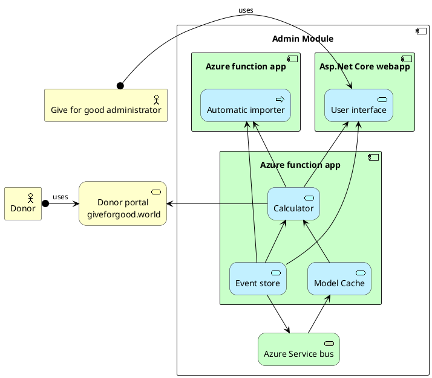

# Admin Module

The admin module consist of several components, hosted on Microsoft Azure:

```plantuml
@startuml
!include <archimate/Archimate>

Business_Actor(Administrator, "Give for good administrator")
Business_Actor(Donor, "Donor")
Business_Service(Web, "Donor portal\n giveforgood.world")
component "Admin Module" as Admin {
    component "Asp.Net Core webapp" as AzWeb #Technology {
        Application_Service(Ui, "User interface")
    }
    component "Azure function app" as AzFnc1 #Technology {
        Application_Service(EventStore, "Event store")
        Application_Service(Calculator, "Calculator")
        Application_Service(ModelCache, "Model Cache")
    }
    Technology_Service(Queue, "Azure Service bus")
    component "Azure function app" as AzFnc2 #Technology {
        Application_Process(AutoImport, "Automatic importer")
    }
    
    Ui <-- Calculator
    Ui <-- EventStore
    Calculator <-- EventStore
    Calculator <-- ModelCache
    EventStore --> Queue 
    ModelCache <-- Queue 
    AutoImport <-- EventStore
    AutoImport <-- Calculator
}
Administrator @-> Ui : uses
Donor @-> Web : uses
Calculator -l-> Web 

url for EventStore is [[event_store]]
url for ModelCache is [[model_cache]]
url for Calculator is [[calculator]]
url for AutoImport is [[auto_import]]
url for Donor is [[donor]]
url for Admin is [[admin_module]]
@enduml
```