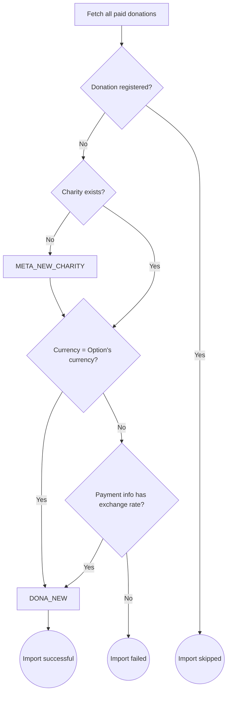

# Automatic importer

The automatic importer is a component, implemented as an Azure function, that retrieves the donations made from the [giveforgood.world](https://giveforgood.world) website on a daily basis and imports them into the [admin module](./admin_module).

## Logic

For every donation the following is flowchart is followed:

## Scheduling

A daily import process is scheduled that takes into account the last three days.
This way, when a job occasionally fails, the donations are imported a few days later.
Also a monthly import is scheduled to sweep anything that still hasn't been synchronized to the admin module.

Before each [enter](./conversion_day#the-in-process) the run state of these processes should be checked, to make sure all donations are taken into account.