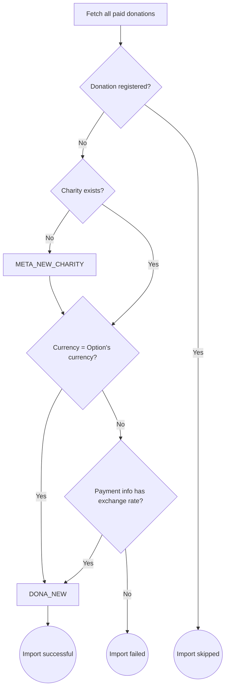

# Automatic importer

The automatic importer is a component, implemented as an Azure function, that retrieves the donations made from the [giveforgood.world](https://giveforgood.world) website on a daily basis and imports them into the [admin module](./admin_module).

## Logic

For every donation the following is flowchart is followed:

