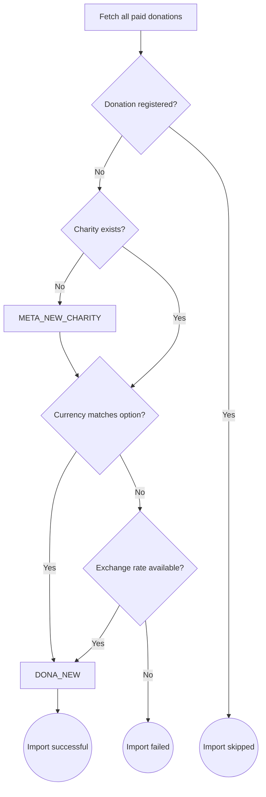

# Automatic Importer

The automatic importer is an Azure Function that synchronizes donations from the [giveforgood.world](https://giveforgood.world) website into the [admin module](./admin_module) on a daily basis.

## Import Logic

For each donation, the following process is executed:

- Donations are fetched and checked for prior registration.
- If the charity does not exist, a new charity event is created.
- Currency mismatches are handled using exchange rates if available; otherwise, the import fails for that donation.
  - Applied exchange rates are used when available on the payment platform
  - Otherwise an external API is used to estimate the applied exchange rate
- Successfully processed donations are registered as new donation events.
- Already registered donations are skipped.
- When donations are cancelled in the mean time, cancellation events are emitted.

## Scheduling

- The import runs daily, processing donations from the last three days to ensure reliability in case of missed jobs.
- A monthly sweep is scheduled to catch any donations not previously synchronized.
- Before each [conversion day entry](./conversion_day#cash-in-process), the status of import jobs should be verified to ensure all donations are accounted for.

This process ensures that all donations are reliably imported, charities are kept up to date, and currency issues are handled appropriately.