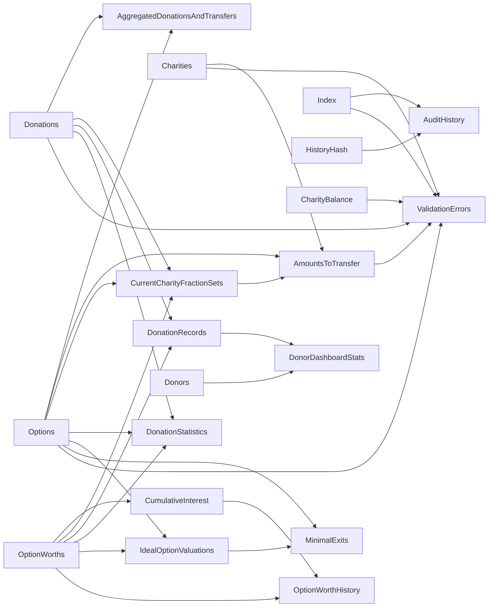

# Calculator

The calculator module is responsible for all calculations for Give for Good.
It is modelled as state transitions due to events and may be dependent on other models so simplify calculations.

```pumlarch
component "Admin Module" as Admin {
    ~admin_ui|auto_import d calculator|event_store
    ~calculator d event_store|model_cache    
}
~calculator l website
```

## Calculator core

The model is a cross product of all submodels.

$$
    M_t = \Pi_i m_{i,t}
$$

Simple submodels can be calculated based on the old state and the event to be processed:

$$
    m_t \times E \rightarrow m_{t+1}
$$

But they also may take advantage of the information in other submodels:

$$
    M_t \times E \rightarrow m_{t+1}
$$

For dependent models both the old value and the calculated values may be used:

$$
    M_t \times m_{i,t+1} \times E \rightarrow m_{j,t+1}
$$

These submodels are of course not allowed to have circular dependencies on the calculated (t+1)submodels.

```plantuml
!include <archimate/Archimate>

Application_DataObject(ModelT, "Model @ t")
rectangle Other as "Other Models" {
    Application_DataObject(OModelT, "Other models @ t")
    Application_DataObject(OModelT1, "Other models @ t+1")
}
Business_Event(Event, "Event")
Application_Service(Calc, "Model calculator")
Application_DataObject(ModelT1, "Model @ t+1")

OModelT -r-> Calc
OModelT1 -r-> Calc
ModelT -> Calc
Event --> Calc
Calc -> ModelT1

OModelT -[hidden]- OModelT1

note bottom of OModelT1 : No recursiveness on \nt+1 model dependencies

url for Event is [[event]]
```

Because the calculation of the model is **entirely** dependent on the previous model and the event at the specific position in the sequence, all calculations are pure, and cacheable.

### Models

The Index model keeps track of the index of the current event. 
Every index in the sequence has an event associated with it that lead to the current state.
For the event that preceded the start state (at t=0), the [NONE](./events/NONE.md) is assumed to have happened.



## Caching

When making a request for some model, the calculator tries to minimize the work being done.
The [branch](./branch) is checked for cached [`HistoryHash` models](./models/history_hash) which can be used to retrieved cached models of other types.
Because the `HistoryHash` uniquely determines the entire historical sequence of events, all calculated data can be indexed by this hash.

The calculator has a caching strategy which drives the [Model cache](./model_cache) to store data on the calculator's behalf.

## Theories

A theory is the way the calculator supports calculating models based on a current situation plus some events that have not (yet) been imported into the [Event store](./event_store).
Using the [`ValidationErrors` model](./models/validation_errors) the set of events can be checked for errors on import on some existing sequence of events.
Theories are also used for calculating the [`MinimalExits`](./models/minimal_exits) for an investment option.

Results from theory requests are not cached in the [Model cache](./model_cache).

