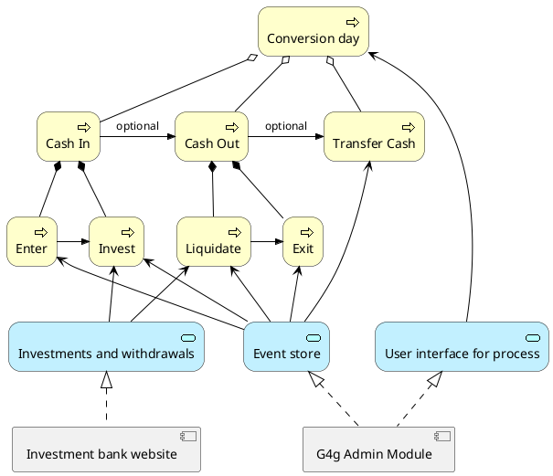

# Conversion day

Conversion day exist of three different subprocesses, which may or may not occur on the same day. 

## Overview



## Models

The conversion day process makes use of some models in the [calculator module](./calculator).

```plantuml
!include <archimate/Archimate>

Business_Process(Transfer, "Transfer Cash")
Business_Process(Enter, "Enter")
Business_Process(Invest, "Invest") 
Business_Process(Liquidate, "Liquidate")
Business_Process(Exit, "Exit")

Enter ->> Invest
Invest ->> Liquidate : optional
Liquidate ->> Exit
Exit ->> Transfer : optional

component Calculator {
    Application_DataObject(IOV, "Ideal option valuations")
    Application_DataObject(OW, "Option worths")
    Application_DataObject(ME, "Minimal exits")
    Application_DataObject(ATT, "Amounts to transfer")
}

OW .> IOV
IOV .> ME
Enter .-> OW
IOV -u-> Exit
ME -u-> Exit
Exit .-> OW
Exit .-> ATT
Transfer <.-> ATT

url of Exit is [[#exit]]
url of Transfer is [[#the-transfer-process]]
url of IOV is [[models/ideal_option_valuations]]
url of ME is [[models/minimal_exits]]
url of OW is [[models/option_worths]]
url of ATT is [[models/amounts_to_transfer]]
```

## The in process

The in process supports the cashflow of donations into the investmet option and consists of two steps:

* [Enter](./events/CONV_ENTER)
* [Invest](./events/CONV_INVEST)

These steps are usually executed right after each other.
Enter indicates the state change of unentered donations to entered donations, which means they're going to participate in the [investment option](./option) from that moment on.
Invest is a step that allows the administration of the transfer of monetary funds from the cash part to the invested part of the investment option.
The investment option's [worth](./worth) is not modified by this step.

## The out process

The out process supports the cashflow of invested funds out of the investment option for allocation of monetary funds to the [charity](./charity) and consists of two steps:

* [Liquidate](./events/CONV_LIQUIDATE)
* [Exit](./events/CONV_EXIT)

These steps are usually executed right after each other.
Liquidate is a step that allows the administration of the transfer of monetary funds from the invested part to the cash part of the investment option.
The investment option's [worth](./worth) is not modified by this step.
Exit indicates the transfer of monetary funds out of the investment option for [allocation](./allocation) to [charities](./charity).

### Exit

The exit step uses the [Calculator](./calculator) for calculating two specific values:

* The exit amount that should be withdrawn based on the profit since the last exit and the [reinvestment fraction](./option_fractions). This value **could** be negative.
* The amount that should be withdrawn based on the [bad year fraction](./option_fractions#bad-year-fraction) and the amount of time since the last exit. This value is **always** positive.

The exit amount should be the largest of these two, always resulting in a positive amount.

## The transfer process

The transfer process uses the [CONV_TRANSFER](./events/CONV_TRANSFER) event to administer exactly how much funds have been transferred to each [charity](./charity).
