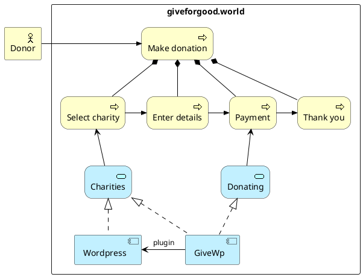

# Donation

A donation is a paid monetary amount by some [donor](./donor) in some (probably default) [investment option](./option) for some beneficiary [charity](./charity) or [theme](./theme).
The monetary amount is exchanged to the investment option's currency if needed.

## Making a donation

```arch(plantuml)
$steps = (#select, #details, #payment, #thanks);
$services = (#charity_repo, #donating_svc);
donor;

> rectangle Web as "giveforgood.world" {
    donor r #donate;
    $steps;
    #donate d $steps;
    $steps d $services;

>    component Wordpress #Application
>    component GiveWp #Application

>    Wordpress .u-|> donation__charity_repo
>    GiveWp .u-|> donation__donating_svc
>    GiveWp -l-> Wordpress : plugin
>    donation__charity_repo <|-. GiveWp

> }
```



When a donation is made, it goes through several stages:

```plantuml
[*] --> Registered : Make donation
Registered --> Unentered : Imported by [[auto-import Auto import]]
Unentered --> Entered : [[events/CONV_ENTER Enter event]] on [[conversion_day Conversion day]]
Entered --> [*]
Registered : Data in GiveWP
Unentered : Data in admin module
Entered : Monetary funds part of [[option investment option]]
```
