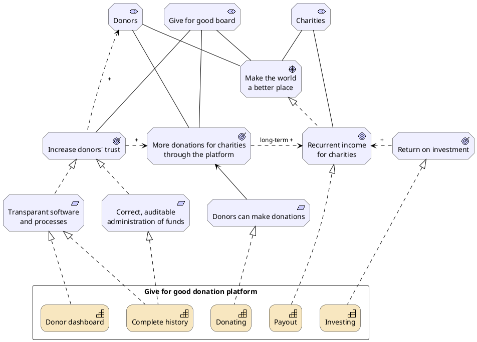

# Give for Good 

Welcome to the documentation wiki for Give for Good.
Described here are the architecture and business processes that pertain to Give for Good.

## Organizational motivation for a platform

Give for good is a non-profit organization that allow donors to donate money indirectly to charities.
The donated money is first invested in green/sustainable stock funds.
A part of the profits is donated to the selected charities anually, a small part is used to support the platform, and the rest is used for reinvestment.




## Stakeholders

We identify the following stakeholders:

* Give for good board
* [Charities](./charity)
* [Donors](./donor)

## Drivers

To achieve the necessary trustworthiness of a good cause, we have to have an open and correct administration of everyone's donations.

### Correctness

There is a strict requirement for a correct administration. 
If funds go missing, it will affect our trustworthiness negatively.

### Transparancy

Being transparant in process, software and data convinces people of Give for Good's trustworthiness.

## User roles

```plantuml
!include <archimate/Archimate>

Business_Role(Donor, "Donor")
Business_Role(WebAdmin, "Website administrator")
Business_Role(Admin, "Donations \nadministrator")

Business_Process(CDay, "Conversion day")
Business_Process(Donating, "Donating")

Donor -->> Donating
Admin -->> CDay

Business_Service(AdminModule, "Admin module")
Business_Service(Web, "giveforgood.world")

CDay <-- AdminModule
Donating <-- Web
WebAdmin <--- Web

url for Donor is [[donor]]
url for Donating is [[donation]]
url for CDay is [[conversion_day]]
url for AdminModule is [[admin_module]]
```
