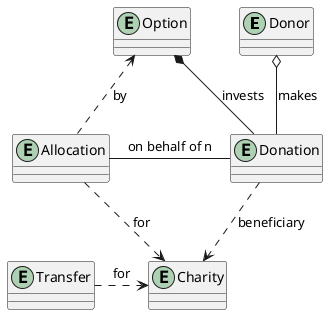

# Give for Good

Give for Good is a non-profit organization that empowers [donors](./donor) to provide their chosen [charities](./charity) with a recurring source of income.
Donations are invested in the stock market, and the profits generated are allocated to the selected charities.

At least once a year, a [conversion day](./conversion_day) is held to determine how much profit should be transferred to each charity, based on the performance of investments and donor selections.

## Platform Components

Two main components support the business processes:

- The [Admin module](./admin_module): Manages donations, investments, allocations, and transfers.
- The [Give for Good website](https://giveforgood.world): Provides a user interface for donors to make donations and track their impact.


```plantuml
@startuml
entity Donor
entity Donation
entity Charity
entity Option
entity Allocation
entity Transfer

Donor o-- Donation : makes
Donation ..> Charity : beneficiary
Option *-- Donation : invests

Allocation - Donation : on behalf of n
Allocation ..> Charity : for
Option <.. Allocation : by
Transfer .> Charity : for
url for Donor [[./donor]]
url for Donation [[./donation]]
url for Charity [[./charity]]
url for Option [[./option]]
url for Allocation [[./allocation]]
url for Transfer [[./transfer]]
@enduml
```

A [donor](./donor) makes a [donation](./donation), which is invested in an [investment option](./option) and designates a [charity](./charity) as the beneficiary.
Profits are allocated by [allocation](./allocation) and transferred to the charity via [transfer](./transfer).

## Business Processes

Key business processes include:

- [Making a donation](./donation#making-a-donation)
- [Conversion day](./conversion_day)
  - [Cash in process](./conversion_day#cash-in-process)
  - [Cash out process](./conversion_day#cash-out-process)
- [Payout to charities](./payout)
- Other processes outside the admin module (to be identified)

## Motivation for the Platform

Donated funds are invested in green and sustainable stock funds.
Profits are distributed annually to charities, with a portion supporting the platform and the remainder reinvested.

```arch(plantuml)
$stakeholders = (motivation#donor, motivation#board, motivation#charities);
$drivers = motivation#better_place;
$goals = (motivation#trust, motivation#donations, motivation#income, motivation#roi);
$requirements = (motivation#insight, motivation#transparency, motivation#correctness, motivation#donating);

$stakeholders; $drivers; $goals; $requirements;

$stakeholders d $drivers;
$stakeholders d 2 $goals;
$drivers d $goals;
$goals d $requirements;

> motivation__donor -[hidden]d-- motivation__trust
```

Motivations are realized through:

```arch(plantuml)
$motivation = (motivation#insight, motivation#transparency, motivation#correctness, motivation#donating, motivation#income, motivation#roi);
$strategy = (strategy#dashboard, strategy#history, strategy#donating, strategy#payout, strategy#investment);

$motivation;
>rectangle Platform as "Give for good donation platform" {
    $strategy u $motivation;
>}
>url for Platform is [[platform]]
```

## Stakeholders

- Give for Good board
- [Charities](./charity)
- [Donors](./donor)

## Drivers and Goals

The main driver is to make the world a better place by providing charities with stable, recurring income.
Key outcomes and goals include:

- Building trust with donors
- Increasing donations
- Generating investment returns

## Requirements

To ensure trust, the platform maintains an open and accurate administration of all donations.

### Making Donations

Donations are made via the [Give for Good website](https://www.giveforgood.world) and associated plugins.
Donations are periodically synchronized to the admin module using the [automatic importer](./auto_import).

### Correctness

A strict requirement for accurate administration is enforced.
Any discrepancies can undermine trust.
A separate accounting administration is maintained alongside the admin module to ensure consistency.

### Transparency

Transparency in processes, software, and data is essential for trust.
Data transparency is balanced with privacy requirements under GDPR.

### Insight

Donation history is made visible in a [donor dashboard](./donor_dashboard).

* The following data are made visible:
  * The original donated amount, possibly converted to the [option's](./option) currency.
  * The assigned charity.
  * The donation's worth.
  * The amount allocated to charity for a donation.
* These data should be visible for multiple points in time.
* These data should alse be made visible in aggregations per donor.

## User Roles

```arch(plantuml)
$roles = (roles#donor, roles#web_admin, roles#donation_admin);
$processes = (donating_process, conversion_day, payout);
$sites = (website, admin_module);

$roles;

$roles d $processes;
$processes d $sites;
website u 2 roles#web_admin;
```
