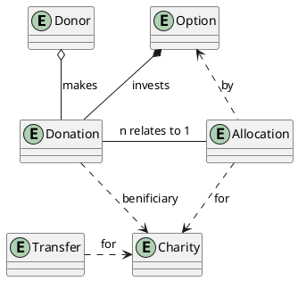

# Give for Good

Give for Good is a non-profit organization that facilitates donors to give their favorite [charities](./charity) a recurring source of income.
It achieves this by investing the donated money in the stockmarket, with the selected charity as the ultimate benificiary of the profits made.
At least once a year a so called [conversion day](./conversion_day) takes place by calculating exactly how much funds should be transferred to the different charities, depending on how much profit has been made and on the selected charities of the donations.

To facilitate the business processes involved two components play a big role in the organisation's architecture:

* The [Give for Good website](https://www.giveforgood.world).
* The [Adminstration module](./admin_module).


```plantuml
@startuml
entity Donor
entity Donation
entity Charity
entity Option
entity Allocation
entity Transfer

Donor o-- Donation : makes
Donation ..> Charity : benificiary
Option *-- Donation : invests

Donation - Allocation : n relates to 1
Allocation .> Charity : for
Option <. Allocation : by
Transfer .> Charity : for
url for Donor [[./donor]]
url for Donation [[./donation]]
url for Charity [[./charity]]
url for Option [[./option]]
url for Allocation [[./allocation]]
url for Transfer [[./transfer]]
@enduml
```

A [donor](./donor) makes a [donation](./donation) (implicitly for investment in a [investment option](./option)) and selects a [charity](./charity) as a benificiary for the profits allocated to it by [allocation](./allocation). 
These allocated funds are transferred to the charity by a [transfer](./transfer).

## Business processes

The following business processes can be identified:

* [Making a donation](./donation#making-a-donation)
* [Conversion day](./conversion_day)
    * [Conversion of funds going in and investing them](./conversion_day#the-in-process)
    * [Conversion of funds going out and allocating them to charities](./conversion_day#the-out-process)
* [Payout to charities](./payout)
* Other processes that are present outside of the admin module still need to be identified.

## Organizational motivation for a platform

The donated money is first invested in green/sustainable stock funds.
A part of the profits is donated to the selected charities anually, a small part is used to support the platform, and the rest is used for reinvestment.

```arch(plantuml)
$stakeholders = (motivation#donor, motivation#board, motivation#charities);
$drivers = motivation#better_place;
$goals = (motivation#trust, motivation#donations, motivation#income, motivation#roi);
$requirements = (motivation#insight, motivation#transparancy, motivation#correctness, motivation#donating);

$stakeholders; $drivers; $goals; $requirements;

$stakeholders d $drivers;
$stakeholders d 2 $goals;
$drivers d $goals;
$goals d $requirements;

> motivation__donor -[hidden]d-- motivation__trust
```

Motivations are realized as follows:

```arch(plantuml)
$motivation = (motivation#insight, motivation#transparancy, motivation#correctness, motivation#donating, motivation#income, motivation#roi);
$strategy = (strategy#dashboard, strategy#history, strategy#donating, strategy#payout, strategy#investment);

$motivation;
>rectangle Platform as "Give for good donation platform" {
    $strategy u $motivation;
>}
>url for Platform is [[platform]]
```


## Stakeholders

We identify the following stakeholders:

* Give for good board
* [Charities](./charity)
* [Donors](./donor)

## Drivers

To achieve the necessary trustworthiness of a good cause, we have to have an open and correct administration of everyone's donations.

### Correctness

There is a strict requirement for a correct administration. 
If funds go missing, it will affect our trustworthiness negatively.

### Transparancy

Being transparant in process, software and data convinces people of Give for Good's trustworthiness.

## User roles

```arch(plantuml)
$roles = (roles#donor, roles#web_admin, roles#donation_admin);
$processes = (donating_process, conversion_day);
$sites = (website, admin_module);

$roles;

$roles d $processes;
$processes d $sites;
website u 2 roles#web_admin;
```

## Software

The software supporting the Give for Good organization comprises of two business functions:

* The [Admin module](./admin_module), a module for the administration of donations, investments and transfers.
* The [Give for Good website](https://giveforgood.world), a front end for (potential) donors.
