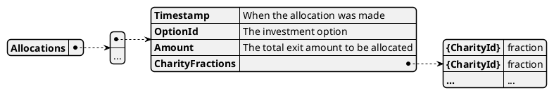

# Model Allocations

This model records the assignment of exit amounts to charities for each investment option, based on their fractional ownership.

## Purpose

Allocations determine how much of the exit value of each option is assigned to each charity, according to their fractional ownership at the time of exit.
This is the basis for subsequent transfers and payouts.

## Structure

The model is a list of allocation records:

## Relationships

- Generated by: [Calculator](../calculator)
- Uses: [CharityFractionSets](./charity_fraction_sets)
- Consumed by: [AmountsToTransfer](./amounts_to_transfer), [Payout](../payout)
- Related events: [`CONV_EXIT`](../events/CONV_EXIT)

## Implementation Notes

- Allocations are created when an option exits, using the current charity fraction set.
- The model is updated via event sourcing and is immutable.
- Each allocation is used to determine the amounts owed to charities, which are then transferred or rolled over to future payouts if not immediately paid.
