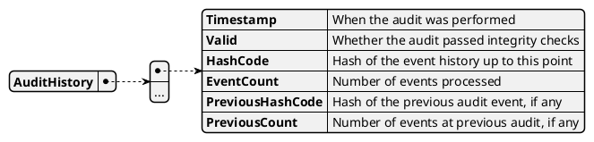

# Model AuditHistory

This model records the results of periodic audit events, providing a cryptographically secure audit trail of the event history and system state.

## Purpose

AuditHistory enables verification of the integrity and consistency of the event stream, supporting regulatory, compliance, and transparency requirements.
It allows detection of tampering, reordering, or loss of events by storing hashes and event counts for each audit moment.

## Structure

The model is an immutable list of audit moments, each with the following fields:

## Relationships

- Generated by: [Calculator](../calculator) via [`AUDIT`](../events/AUDIT) events
- Uses: [HistoryHash](./history_hash), [Index](./index)

## Implementation Notes

- Each audit moment is created by processing an `AUDIT` event, which includes the current hash and event count.
- The model is updated via event sourcing and is immutable.
- Hashes are computed using the HistoryHash model, ensuring cryptographic integrity.
- Used for generating audit reports and exporting audit data for external verification.
