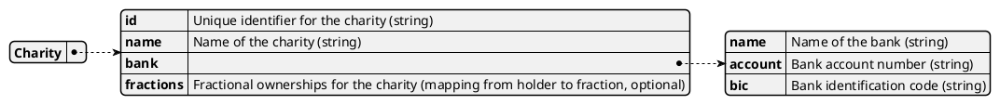

# Model Charities

The charities model represents all charitable organizations registered on the platform.
It stores essential information about each charity, including identification and banking details.

## Structure

## Purpose

The charities model enables:

- Management and administration of charity records
- Linking donations and allocations to specific charities
- Supporting reporting and transparency for donors and platform administrators

