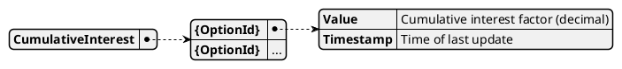

# Model CumulativeInterest

This model tracks the cumulative interest factor for each investment option over time, reflecting the effect of price changes, investments, and inflation events.

## Purpose

CumulativeInterest provides a running multiplier for each option, used to adjust the worth of investments and calculate returns. It is essential for accurate valuation and reporting.

## Structure

The model is a dictionary mapping option IDs to data points:

## Relationships

- Generated by: [Calculator](../calculator)
- Uses: [OptionWorths2](./option_worths)
- Consumed by: [OptionWorthHistory](./option_worth_history), [IdealOptionValuations](./ideal_option_valuations)
- Updated by: [`PRICE_INFO`](../events/PRICE_INFO), [`CONV_INFLATION`](../events/CONV_INFLATION), [`CONV_LIQUIDATE`](../events/CONV_LIQUIDATE), [`CONV_INVEST`](../events/CONV_INVEST), [`CONV_EXIT`](../events/CONV_EXIT)

## Implementation Notes

- The cumulative interest factor is updated whenever relevant events affect the option's worth, such as price changes, investments, inflation, or liquidation.
- The factor is multiplicative: each event applies a change to the previous value.

To calculate the interest earned over a specific interval of time, divide the cumulative interest factor at the end of the interval by the factor at the start:

$$
    \text{Interest}_{\text{start} \rightarrow \text{end}} = \frac{\text{CumulativeInterest}_{\text{end}}}{\text{CumulativeInterest}_{\text{start}}}
$$

This ratio gives the total growth (including compounding) over the interval for the option.
