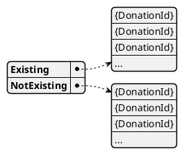

# Donation Existence

The donation existence model computes the presence of each donation in the platform.
It provides the information needed to effectively filter import batches from the [auto importer](../auto_import).

## Structure

The input structure is a list of donation identifiers.
The output contains the same identifiers, split into two collections:

* `Existing`
* `NotExisting`

## Purpose

- Ensures that every donation can be verified.
- Enables validation of donation-related processes and import data.

