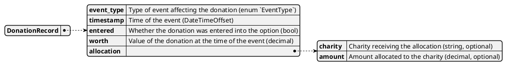

# Donation Records

The donation records model provides a detailed history of each donation, including its value over time and any allocations made to charities.
It is built using the `DonationRecords2` calculator, which reconstructs the donation's lifecycle and financial impact based on platform events and option worth history.

## Structure

## Purpose

- Tracks the complete financial history of each donation, including changes in worth and allocations to charities.
- Supports auditability and transparency for donors, charities, and administrators.
- Enables reporting on donation impact, allocation timing, and payout calculations.

## Calculation Logic

The model is calculated by replaying relevant events:
- The initial donation is recorded with its timestamp and amount.
- For each event in the option's worth history (such as exits or liquidations), the donation's value and any allocations are updated.
- Allocations are calculated proportionally based on the donation's share and the option's divisor at the time of the event.

