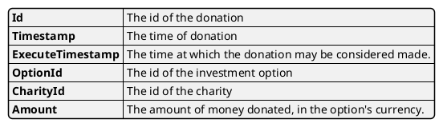

# Model Donations

This model keeps track of all donations that have been made.

Information about the [investment option](../option) and [charity](../charity) are also recorded.

## Events

Events that affect this model are:

* [`DONA_NEW`](../events/DONA_NEW.md) records a new donation.
* [`DONA_CANCEL`](../events/DONA_CANCEL) removes a donation.
* [`DONA_UPDATE_CHARITY`](../events/DONA_UPDATE_CHARITY) updates the charity id for the donation.

