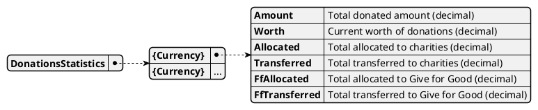

# Model DonationsStatistics

This model aggregates statistics for all donations, grouped by currency, including amounts, worth, allocations, and transfers.

## Purpose

DonationsStatistics provides a summary of donation activity for reporting, auditing, and dashboard purposes. It enables analysis of total donated, allocated, transferred, and current worth per currency.

## Structure

The model is a dictionary mapping currency codes to statistics:

## Relationships

- Generated by: [Calculator](../calculator)
- Uses: [Donations2](./donations), [Options](./options), [OptionWorths2](./option_worths)
- Updated by: [`DONA_NEW`](../events/DONA_NEW), [`DONA_CANCEL`](../events/DONA_CANCEL), [`CONV_TRANSFER`](../events/CONV_TRANSFER), [`CONV_EXIT`](../events/CONV_EXIT)

## Implementation Notes

- Each event affecting donations (new, cancel, transfer, exit) updates the relevant statistics per currency.
- Used for dashboards and reports.
