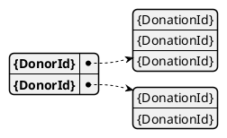

# Model Donors

This model keep track of all the donation ids each donor has made.

This information is used to calculate statistics for the [`DonorDashboardStats` model](./donor_dashboard_stats) and the[donor dashboard](../donor_dashboard) 