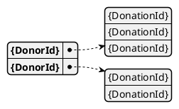

# Model Donors2

This model keeps track of all the donation ids each donor has made.

Donor data is partitioned by donor id.
Each partition contains the list of donation ids for a specific donor.
This enables efficient queries and updates for individual donors, and supports scalable storage as the number of donors grows.

```plantuml
@startyaml
{DonorId}:
  - {DonationId}
  - {DonationId}
  - {DonationId}
{DonorId}:
  - {DonationId}
  - {DonationId}
@endyaml
```

Partitioning on donor id allows for:

- Fast lookup of a donor's donations
- Simplified scaling as donor count increases

This partitioned information is used to calculate statistics for the [`DonorDashboardStats` model](./donor_dashboard_stats) and the [donor dashboard](../donor_dashboard).