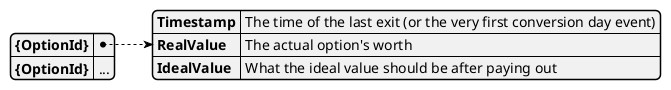

# Model Ideal option valuations

This model administers how much and option should be worth after paying out the non-reinvestment [fractions](../option_fractions). 
On calculating how high the [exit](../events/CONV_EXIT) amount should be, this value is checked against the [options current total worth](./option_worths).

## Dependencies

The model uses current en previous values of [`OptionWorths`](./option_worths) to determine the amount of change in worth of an option.
This value is multiplied by the [reinvestment fraction](../option_fractions) of the [investment option](../option) to determine how the change in worth affects the ideal valuation of the investment option.

This model is used by [`MinimalExits`](./minimal_exits) because of the `RealValue` property, which could be derived solely from the [`OptionWorths` model](./option_worths).

## Events

The ideal valuation is affected by the following events:

* [`CONV_ENTER`](../events/CONV_ENTER)
* [`CONV_INVEST`](../events/CONV_ENTER)
* [`CONV_LIQUIDATE`](../events/CONV_ENTER)
* [`CONV_EXIT`](../events/CONV_ENTER)
* [`CONV_INFLATION`](../events/CONV_INFLATION)
* [`PRICE_INFO`](../events/CONV_ENTER)

### CONV_ENTER

This event changes the worth of an investment option, but is not regarded as 'profit'. 
The increase in worth is of course due to new [donations](../donation) entering into the investment option.

Both the real and ideal valuations are adjusted with the total gain in option worth.

### CONV_EXIT
 
This event changes the worth of an investment option, ideally by adjusting the real valuation to exactly the ideal valuation. 
In case of a [bad year](../option_fractions#bad-year-fraction) this amount can of course be higher than the difference between real and ideal valuations.
This change is not regarded as a 'loss', so only the real valudation is adjusted negatively with the exited amount.

### CONV_INFLATION

This event changes the ideal valuation for an investment option, according to the given inflation factor.
We increase the value of the ideal valuation by the factor in the `CONV_INFLATION` event, because that is how the ideal worth should be affected by the inflation correction.

### Others

The other events affect the option worth in a 'profit'-sense and use the reinvestment fraction.
Both the real and ideal valuations are adjusted, but with different amounts.

