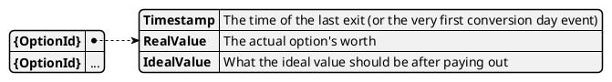

# Model Ideal option valuations

This model records the ideal value of each investment option after paying out the non-reinvestment [fractions](../option_fractions).

When calculating the [exit](../events/CONV_EXIT) amount, the ideal value is compared to the option's current total worth as recorded in [`OptionWorths`](./option_worths).

```plantuml
@startyaml
{OptionId}:
  Timestamp: The time of the last exit (or the very first conversion day event)
  RealValue: The actual option's worth
  IdealValue: What the ideal value should be after paying out
{OptionId}: 
  ...
@endyaml
```

## Dependencies

This model uses current and previous values from [`OptionWorths`](./option_worths) to determine changes in an option's worth.
The change in worth is multiplied by the [reinvestment fraction](../option_fractions) of the [investment option](../option) to calculate how the change affects the ideal valuation.

[`MinimalExits`](./minimal_exits) uses this model because of the `RealValue` property, which could otherwise be derived from [`OptionWorths`](./option_worths).

## Events

The ideal valuation is affected by the following events:

* [`CONV_ENTER`](../events/CONV_ENTER)
* [`CONV_INVEST`](../events/CONV_INVEST)
* [`CONV_LIQUIDATE`](../events/CONV_LIQUIDATE)
* [`CONV_EXIT`](../events/CONV_EXIT)
* [`CONV_INFLATION`](../events/CONV_INFLATION)
* [`PRICE_INFO`](../events/PRICE_INFO)

### CONV_ENTER

This event increases the worth of an investment option, but the increase is not considered 'profit'.
New [donations](../donation) entering the option cause the increase.
However, because the `InvestedAmount` must be registered, a price change is also recorded and treated as 'profit'.

Both real and ideal valuations are adjusted by the total gain in cash value.
The real value is updated with all profits, while the ideal value is updated only with the reinvestment portion of the profits.

### CONV_EXIT

This event adjusts the real valuation of an investment option, ideally bringing it in line with the ideal valuation.
In a [bad year](../option_fractions#bad-year-fraction), the exited amount may exceed the difference between real and ideal valuations.
This change is not considered a 'loss'; only the real valuation is reduced by the exited amount.

### CONV_INFLATION

This event increases the ideal valuation according to the inflation factor specified in the event.
The ideal value is adjusted upward to reflect the inflation correction.

### Other Events

Other events affect the option's worth in terms of 'profit' and use the reinvestment fraction.
Both real and ideal valuations are adjusted, but by different amounts.

