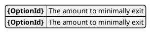

# Model Minimal exits

This model keeps track of the amount to minimally exit based on:

* Timestamp
* Option Worth
* Time since last exit

The minimal exit is calculated on:

* [`CONV_LIQUIDATE`](../events/CONV_LIQUIDATE) 
* [`PRICE_INFO`](../events/PRICE_INFO)

> **Assumption:** [`CONV_EXIT`](../events/CONV_EXIT) always immediately follows a `CONV_LIQUIDATE`, assuming no stock price change in between. 
>
> **Consequence**:  If no liquidation is needed for an exit, a 0 amount liquidation must be added to 'set' the invested amount to the proper value.

This model is used for calculating the amount that should be exited in the [exit step](../conversion_day#exit) of the conversion day process.
For this purpose the exit must be calculated for ([theoretical](../calculator#theories)) `PRICE_INFO` events.