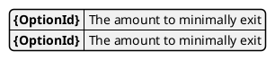

# Model Minimal exits

This model records the minimum amount that must be exited for each option.

The calculation is based on:

* Timestamp
* Option Worth
* Time since the last exit

```plantuml
@startyaml
{OptionId}: The amount to minimally exit
{OptionId}: The amount to minimally exit
@endyaml
```

Minimal exit amounts are calculated for the following events:

- [`CONV_LIQUIDATE`](../events/CONV_LIQUIDATE)
- [`PRICE_INFO`](../events/PRICE_INFO)

> **Assumption:** [`CONV_EXIT`](../events/CONV_EXIT) always immediately follows a `CONV_LIQUIDATE`, assuming no stock price change in between.
>
> **Consequence:** If no liquidation is needed for an exit, a 0 amount liquidation must be added to set the invested amount to the correct value.

This model is used to determine the minimal amount that should be exited during the [exit step](../conversion_day#exit) of the conversion day process.

For this purpose, the exit must also be calculated for ([theoretical](../calculator#theories)) `PRICE_INFO` events.