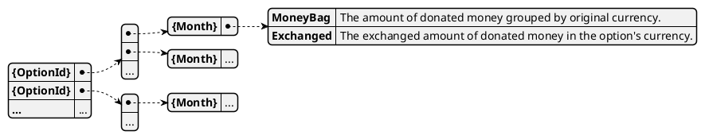

# Model Monthly donations

This model keeps track of all donations that have been made, aggregated per month.

## Events

Events that affect this model are:

* [`DONA_NEW`](../events/DONA_NEW.md) records a new donation.
* [`DONA_CANCEL`](../events/DONA_CANCEL) removes a donation.

