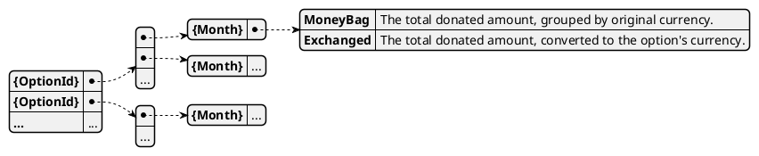

# Model Monthly donations

This model records all donations, aggregated by month for each option.

## Events

The following events affect this model:

* [`DONA_NEW`](../events/DONA_NEW): records a new donation.
* [`DONA_CANCEL`](../events/DONA_CANCEL): removes a donation.

