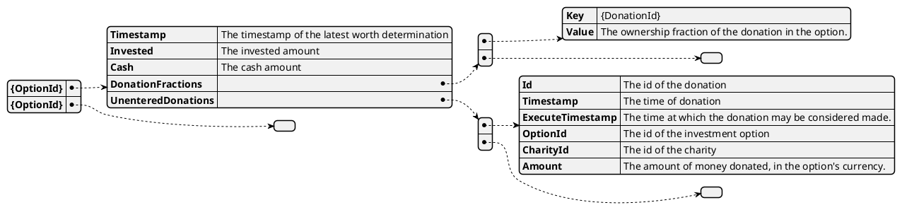

# Model Option worths

This model keeps track of the worths of [investment options](../option).

The following information is tracked by this model:

* The invested amount (can fluctuate due to stock prices fluctuating). 
* The cash amout, is affected by some [events](../event).
* The ownership fractions of donations in the investment option.
* Unentered donations, affected by donation events. This is not yet part of the actual option's worth, but the information is needed on some conversion day events.

## Events

The `OptionWorths` model is affected by the following events:

* [`DONA_NEW`](../events/DONA_NEW)
* [`DONA_CANCEL`](../events/DONA_CANCEL)
* [`META_NEW_OPTION`](../events/META_NEW_OPTION)
* [`CONV_ENTER`](../events/CONV_ENTER)
* [`CONV_INVEST`](../events/CONV_INVEST)
* [`CONV_LIQUIDATE`](../events/CONV_LIQUIDATE)
* [`CONV_EXIT`](../events/CONV_EXIT)
* [`CONV_INCREASE_CASH`](../events/CONV_INCREASE_CASH)
* [`PRICE_INFO`](../events/PRICE_INFO)

### DONA_NEW

When a [new donation](../donation) has been made, it is added to the `UnenteredDonations` collection of the corresponding investment option.

### DONA_CANCEL

When a donation is cancelled, it is removed from the `UnenteredDonations` collection or the `DonationFractions` [fraction set](../fraction_set).

### META_NEW_OPTION

A new option is registered, without any linked donations and with 0 invested and cash amounts.

### CONV_ENTER

The `UnenteredDonations` are checked for donations that have an `ExecuteTimestamp` earlier than the timestamp of the event. 
Those donations are moved from the `UnenteredDonations` to the `DonationFractions` and assigned an ownership fraction of the investment option.
The summed amount of the moved donations is transferred into the cash part of the investment option.

### CONV_INVEST

This event indicates that an investment has been made and that a cash amount has been transferred to the invested part of the investment option.
There is no change in the `DonationFractions` nor the `UnenteredDonations`.

### CONV_LIQUIDATE

This event indicates that a liquidation of stocks has been made and that a part of the invested part of the investment option has been transferred to the cash part.

### CONV_EXIT

This event indicates the withdrawal of funds for the purpose of pay out to [charities](.charities). 
It only affects the cash part of the investment option.

> **Assumption:** [`CONV_EXIT`](../events/CONV_EXIT) always immediately follows a [`CONV_LIQUIDATE`](../events/CONV_LIQUIDATE), assuming no stock price change in between. 
>
> **Consequence**:  If no liquidation is needed for an exit, a 0 amount liquidation must be added to 'set' the invested amount to the proper value.

### CONV_INCREASE_CASH

Investment costs may be covered by a third party, which increases the cash part of the investment option.
It only affects the cash part of the investment option.

### PRICE_INFO

This events adds stock pricing information to the event stream and affects the investment option's total worth.
Both invested and cash parts are present in the event and used to change the entry in the model.

## Usage

This model is used in the [`IdealOptionValuations` model](./ideal_option_valuations) as that model depends on the worth of the investment options.