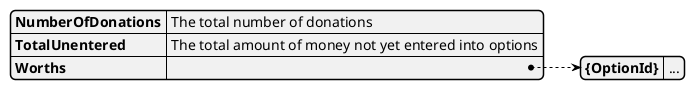
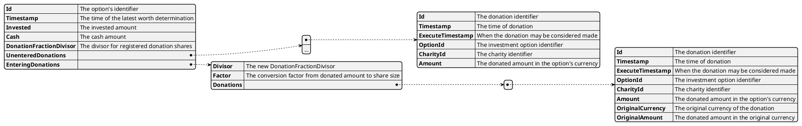
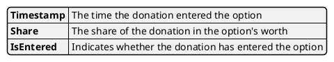

# Model OptionWorths2

This model records the worth of each [investment option](../option).

The following information is tracked:

- Invested amount (fluctuates with stock prices)
- Cash amount (affected by various [events](../event))
- Ownership shares of donations in the option (stored in partitioned details)
- Unentered donations (not yet part of the option's worth, but needed for some conversion day events)

```plantuml
@startyaml
NumberOfDonations: The total number of donations
TotalUnentered: The total amount of money not yet entered into options
Worths:
  {OptionId}: ...
@endyaml
```

Each option is structured as follows:

```plantuml
@startyaml
Id: The option's identifier
Timestamp: The time of the latest worth determination
Invested: The invested amount
Cash: The cash amount
DonationFractionDivisor: The divisor for registered donation shares
UnenteredDonations:
  - Id: The donation identifier
    Timestamp: The time of donation
    ExecuteTimestamp: When the donation may be considered made
    OptionId: The investment option identifier
    CharityId: The charity identifier
    Amount: The donated amount in the option's currency
  - ...
EnteringDonations:
  Divisor: The new DonationFractionDivisor
  Factor: The conversion factor from donated amount to share size
  Donations:
    - Id: The donation identifier
      Timestamp: The time of donation
      ExecuteTimestamp: When the donation may be considered made
      OptionId: The investment option identifier
      CharityId: The charity identifier
      Amount: The donated amount in the option's currency
      OriginalCurrency: The original currency of the donation
      OriginalAmount: The donated amount in the original currency
@endyaml
```

Donation details are indexed by donation id and structured as follows:

```plantuml
@startyaml
Timestamp: The time the donation entered the option
Share: The share of the donation in the option's worth
IsEntered: Indicates whether the donation has entered the option
@endyaml
```

## Events

The `OptionWorths2` model is affected by the following events:

- [`DONA_NEW`](../events/DONA_NEW)
- [`DONA_CANCEL`](../events/DONA_CANCEL)
- [`META_NEW_OPTION`](../events/META_NEW_OPTION)
- [`CONV_ENTER`](../events/CONV_ENTER)
- [`CONV_INVEST`](../events/CONV_INVEST)
- [`CONV_LIQUIDATE`](../events/CONV_LIQUIDATE)
- [`CONV_EXIT`](../events/CONV_EXIT)
- [`CONV_INCREASE_CASH`](../events/CONV_INCREASE_CASH)
- [`CONV_INFLATION`](../events/CONV_INFLATION)
- [`PRICE_INFO`](../events/PRICE_INFO)

### DONA_NEW

A [new donation](../donation) is added to the `UnenteredDonations` collection of the relevant investment option.

### DONA_CANCEL

A cancelled donation is removed from either the `UnenteredDonations` collection or the `DonationFractions` [fraction set](../fraction_set).

### META_NEW_OPTION

Registers a new option with no linked donations and zero invested and cash amounts.

### CONV_ENTER

This [mega event](../model-partition#mega_event) checks `UnenteredDonations` for donations with an `ExecuteTimestamp` earlier than the event's timestamp.
These donations are moved from `UnenteredDonations` and assigned an ownership [share](../share) in the investment option.
The total amount of these donations is transferred into the cash part of the option.

### CONV_INVEST

Indicates an investment has been made, transferring cash to the invested part of the option.
No change in donation details or `UnenteredDonations`.

### CONV_LIQUIDATE

Indicates a liquidation of stocks, transferring part of the invested amount to cash.

### CONV_EXIT

Indicates withdrawal of funds for payout to [charities](../charities).
Only affects the cash part of the option.

> **Assumption:** [`CONV_EXIT`](../events/CONV_EXIT) always immediately follows a [`CONV_LIQUIDATE`](../events/CONV_LIQUIDATE), assuming no stock price change in between.
>
> **Consequence:** If no liquidation is needed for an exit, a 0 amount liquidation must be added to set the invested amount to the correct value.

### CONV_INFLATION

Inflation correction events contain stock pricing information and affect the option's total worth.

### CONV_INCREASE_CASH

Investment costs may be covered by a third party, increasing the cash part of the option.
Only the cash part is affected.

### PRICE_INFO

Adds stock pricing information to the event stream and affects the option's total worth.
Both invested and cash parts are present and used to update the model.

## Usage

This model is used by the [`IdealOptionValuations` model](./ideal_option_valuations), which depends on the worth of investment options.