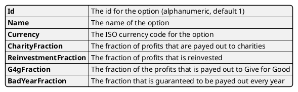

--- 
title: Model Options
author: J.W. Morsink
---
# Model Options

The Options model keeps track of all the registered [options](../option), that have been registered by the [META_NEW_OPTION](../events/META_NEW_OPTION).

It keeps track of the following attributes for each option:

