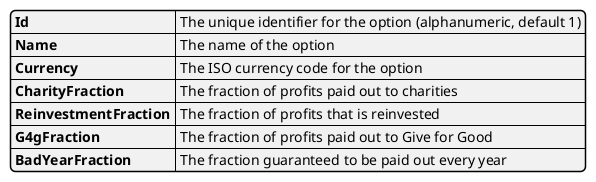

--- 
title: Model Options
author: J.W. Morsink
---

# Model Options

This model records all registered [options](../option), which are created by the [`META_NEW_OPTION`](../events/META_NEW_OPTION) event.

For each option, the following attributes are tracked:

```plantuml
@startyaml
Id: The unique identifier for the option (alphanumeric, default 1)
Name: The name of the option
Currency: The ISO currency code for the option
CharityFraction: The fraction of profits paid out to charities
ReinvestmentFraction: The fraction of profits that is reinvested
G4gFraction: The fraction of profits paid out to Give for Good
BadYearFraction: The fraction guaranteed to be paid out every year
@endyaml
```

