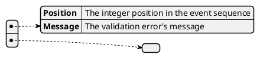

# Model ValidationErrors

The ValidationErrors model keeps track of all Validation errors that have been made, indexed by the [`Index`](./index).

This model should always be empty, and is checked before importing using a [Calculation Theory](./calculator#theories) before importing it into the [Event store](./event_store]).
This also means that if somehow a `ValidationError` has occurred at some historical `Index`, no more [events](../event) can be imported.

