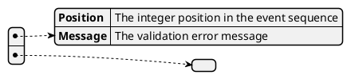

# Model ValidationErrors

This model records all validation errors, indexed by the [`Index`](./index) of the event sequence.

The model should always be empty.
It is checked using a [Calculation Theory](../calculator#theories) before importing events into the [Event store](../event_store).

If a `ValidationError` occurs at any historical index, no further [events](../event) can be imported.

```plantuml
@startyaml
- Position: The integer position in the event sequence
  Message: The validation error message
-
@endyaml
```

## Validation logic

Validation checks are performed on every event before it is imported.

Typical validations include:
- Required fields (e.g. option, charity, donation must be known)
- Value ranges (e.g. fractions must be between 0 and 1, amounts must be positive)
- Consistency checks (e.g. fractions must add up to 1)
- Uniqueness (e.g. new options must not be duplicates)
- Referential integrity (e.g. referenced donations and charities must exist)

If any validation fails, a validation error is recorded at the corresponding index, and event import is halted.
