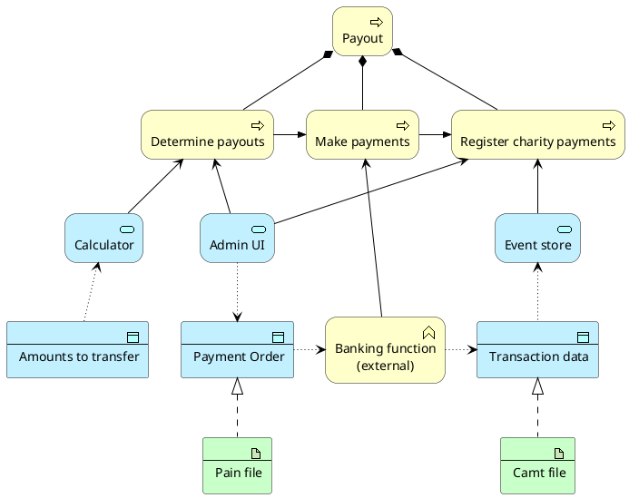

# Payout

The payout process

```plantuml
@startuml
!include <archimate/Archimate>

Business_Process(Payout, "Payout")
Business_Process(DetPay, "Determine payouts")
Business_Process(MakePay, "Make payments")
Business_Function(Bank, "Banking function\n(external)")
Business_Process(RegPay, "Register charity payments")

Application_Service(Admin, "Admin UI")
Application_Service(Events, "Event store")
Application_Service(Calc, "Calculator")
Application_DataObject(ATT, "Amounts to transfer")
Application_DataObject(PayOrd, "Payment Order")
Application_DataObject(Trans, "Transaction data")
Technology_Artifact(Pain, "Pain file")
Technology_Artifact(Camt, "Camt file")

Payout *-- DetPay
Payout *-- MakePay
Payout *-- RegPay
DetPay ->> MakePay
MakePay ->> RegPay
DetPay <-- Calc
DetPay <-- Admin
RegPay <-- Admin
RegPay <-- Events
MakePay <-- Bank

Calc <-~ ATT
Admin ~-> PayOrd
Bank ~> Trans
Events <-~ Trans

PayOrd -[dotted]> Bank

PayOrd <|-. Pain
Trans <|-. Camt

url for Admin is [[admin_module]]
url for Events is [[event_store]]
url for Calc is [[calculator]]
url for ATT is [[models/amounts_to_transfer]]
@enduml
```