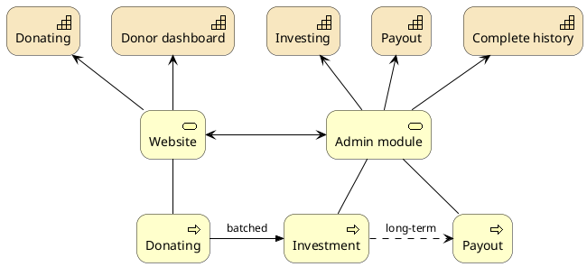

# Platform

```plantuml
@startuml
!include <archimate/Archimate>
sprite $sCap jar:archimate/strategy-capability

Strategy_Capability(CapDonating, "Donating")
Strategy_Capability(CapDashboard, "Donor dashboard")
Strategy_Capability(CapInvest, "Investing")
Strategy_Capability(CapPayout, "Payout")
Strategy_Capability(CapHistory, "Complete history")

    Business_Service(web, "Website")
    Business_Process(Donating, "Donating")
    Business_Service(admin, "Admin module")
    Business_Process(Investment, "Investment")
    Business_Process(Payout, "Payout")

    web -- Donating
    admin -- Investment
    admin -- Payout
    Donating ->> Investment : batched
    Investment .> Payout : long-term
    web <-> admin

    CapDonating <-- web
    CapDashboard <-- web
    CapInvest  <-- admin
    CapPayout <-- admin
    CapHistory <-- admin


url for web is [[https://giveforgood.world]]
url for admin is [[admin_module]]
url for Payout is [[payout]]
url for Donating is [[donation]]
@enduml
```
