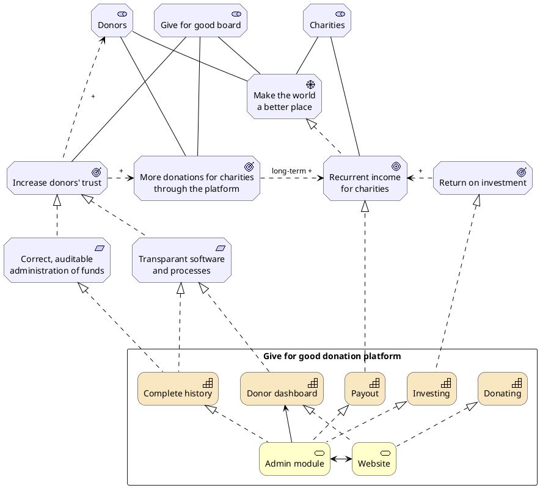

# Platform

```plantuml
@startuml
!include <archimate/Archimate>
sprite $sCap jar:archimate/strategy-capability

rectangle Platform  as "Give for good donation platform" {
    Strategy_Capability(CapDonating, "Donating")
    Strategy_Capability(CapDashboard, "Donor dashboard")
    Strategy_Capability(CapInvest, "Investing")
    Strategy_Capability(CapPayout, "Payout")
    Strategy_Capability(CapHistory, "Complete history")

    Business_Service(web, "Website")
    Business_Service(admin, "Admin module")


    CapDonating <|-. web
    CapDashboard <|-. web
    CapDashboard <-- admin
    CapInvest <|-. admin
    CapPayout <|-. admin
    CapHistory <|-. admin

    admin <-> web 

} 
Motivation_Driver(Better, "Make the world \na better place")
Motivation_Goal(Income, "Recurrent income \nfor charities")
Motivation_Requirement(Correctness, "Correct, auditable \nadministration of funds")
Motivation_Requirement(Transparancy, "Transparant software \nand processes")
Motivation_Outcome(Donations, "More donations for charities \nthrough the platform")
Motivation_Outcome(Trust, "Increase donors' trust")
Motivation_Outcome(Roi, "Return on investment")

Motivation_Stakeholder(Charities, "Charities")
Motivation_Stakeholder(Board, "Give for good board")
Motivation_Stakeholder(Donor, "Donors")

CapHistory .-u-|> Correctness
CapHistory .-u-|> Transparancy
CapDashboard .-|> Transparancy
CapInvest .-u--|> Roi
CapPayout .-|> Income
Charities -- Income
Donations .> Income : long-term +
Income <. Roi : +
Donor <-. Trust : +
Donor --- Donations
Board --- Donations
Board --- Trust
Trust .> Donations : +
Trust <|-. Correctness
Trust <|-. Transparancy

Better <|-. Income
Board -- Better
Charities -- Better
Donor -- Better

url for web is [[https://giveforgood.world]]
url for admin is [[admin_module]]
url for Charities is [[charity]]
url for Donor is [[donor]]
@enduml
```
